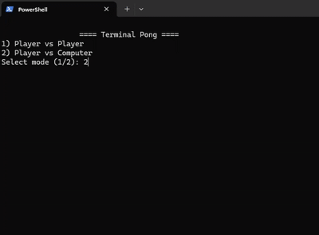
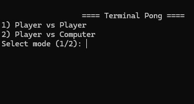
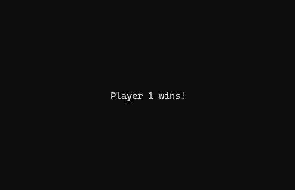

# Terminal Pong V2 🕹️

A **100 % text‑mode Pong clone** that runs directly in your terminal using nothing but ANSI escape codes and the Python standard library. No external dependencies, no curses — just print statements and keyboard polling.



---

## 🚀 Features

* Cross‑platform (**Windows, macOS, Linux, WSL, Git Bash…**)
* Two game modes: **Player vs Player** or **Player vs Computer** (70 % smart AI)
* Smooth 30 FPS redraw with an in‑memory frame‑buffer
* Top & bottom borders that the ball bounces off
* Incremental ball speed‑up after every paddle hit
* First to **4 points** wins, with a victory banner
* Clean code split into `terminal_helpers.py`, `renderer.py`, `gameobjects.py`, and `main.py`

---

## 📂 Project layout

```text
terminal‑pong‑v2/
├── main.py               # Entry point & game loop
├── renderer.py           # 2‑D frame‑buffer → ANSI blitter
├── terminal_helpers.py   # ANSI helpers + cross‑platform key reader
├── gameobjects.py        # Paddle & Ball dataclasses
└── images/               # (optional) screenshots / GIFs for the README
```

> **Note:** All logic lives in the four .py files; there are *no* third‑party packages.

---

## 🛠️ Setup

\### Linux / macOS

```bash
# 1.  Clone the repo
$ git clone https://github.com/your‑user/terminal‑pong‑v2.git
$ cd terminal‑pong‑v2

# 2.  Create & activate a virtual environment (optional but recommended)
$ python3 -m venv venv
$ source venv/bin/activate

# 3.  Run the game
$ python main.py
```

\### Windows (cmd / PowerShell)

```powershell
# 1.  Clone (or download) the repo
PS> git clone https://github.com/your‑user/terminal‑pong‑v2.git
PS> cd terminal‑pong‑v2

# 2.  Create & activate a virtual environment
PS> py -3 -m venv venv
PS> .\venv\Scripts\activate

# 3.  Run the game
PS> python main.py
```

> **Windows 10 / 11 tip:** The default terminal supports ANSI escape codes out of the box. If you use an ancient console that doesn’t, install Windows Terminal or enable *Virtual Terminal* sequences.

There are **no further dependencies** — the game uses only the Python standard library.

---

## 🎮 Gameplay & Controls

| Mode                 | Player 1  | Player 2 / Computer       | Quit |
| -------------------- | --------- | ------------------------- | ---- |
| **Player vs Player** | `W` / `S` | `↑` / `↓` arrow keys      | `Q`  |
| **Player vs CPU**    | `W` / `S` | AI moves the right paddle | `Q`  |

* Select your mode from the start menu (enter **1** or **2**).
* First to **4** points wins. A banner appears — press any key to exit.

---

## 🖼️ Screenshots

| Main menu                              | Mid‑game rally                                 | Victory banner                       |
| -------------------------------------- | ---------------------------------------------- | ------------------------------------ |
|  |  |  |

---

## ✨ How it works

1. **`terminal_helpers.KeyPoller`** sets the terminal to *raw mode* (Unix) or uses `msvcrt` (Windows) to read single key presses without blocking. Arrow keys are normalised to `"UP"`/`"DOWN"`.
2. **`renderer.TerminalRenderer`** keeps a 2‑D list of characters (the frame‑buffer). Each frame it:

   * Clears the buffer.
   * Asks game objects to `draw()` themselves into it.
   * Sends the result to the terminal with an ANSI *cursor‑home* escape so the previous frame is overwritten in place.
3. **`main.py`** drives the fixed‑time‑step game loop: input → physics → collision → draw, 30 times per second.
4. **AI paddle** tracks the ball position with a 70 % chance of perfect movement and 30 % chance of slowed movement, giving humans a fair shot.
5. The **ball speeds up** a tiny factor (`1.003×`) on every physics tick until someone scores, after which its speed resets.

Everything funnels through printed strings, so you can port the renderer to curses, Pygame, or SDL later without touching game logic.

---

## 📜 License

MIT — do whatever you want, just keep the copyright.

Happy hacking & have fun pong‑ing in your terminal! 🎉
